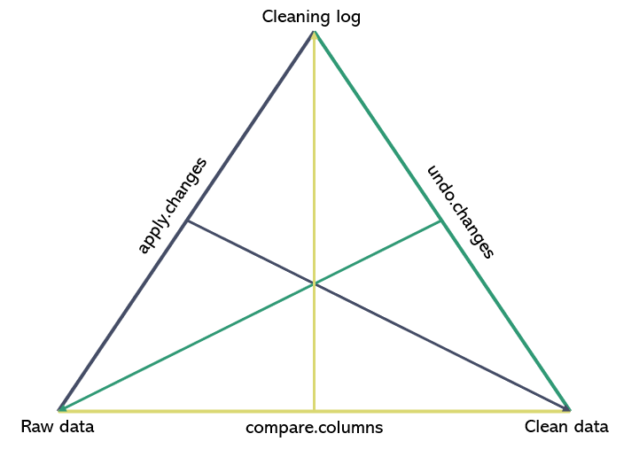

```{r, include = FALSE}
knitr::opts_chunk$set(
  collapse = TRUE,
  comment = "#>"
)
```

The typical Impact workflow of cleaning the data is essentially a process of transformation of a raw dataframe into a clean one with documenting all of the changes made in the cleaning log document. This set of functions can be generally called **cleaning log transformers**.  utilityR provides the user with three cleaning log transformers that allow the data staff to switch to any of the three main data cleaning objects by using the other two.

Please note that the use cases are not exclusive to final versions of cleaning log and clean data. The transformer functions can and should be called intermittently during the cleaning process applying/undoing/comparing different stages of cleaning.



**compare.columns** - How to create a cleaning log out of raw and clean dataframes.

This functionality is primarily oriented for the cases when there some manual cleaning has been done to the dataframe. This fits well for cases of location specification and other changes that have been implemented on case by case basis.
The function requires the user to specify the list of columns that need to be compared between the raw and clean dataframes, the dataframes themselves, the name of the unique id column in both dataframes, specification of whether the data is a loop and a description of the issue that cause a need for the manual check.


Please note that this function will only check those `uuid`s and column names that are present in the clean data. If the `uuid` entry is missing, it is considered deleted.
```{r setup}
library(utilityR)
library(dplyr)
library(knitr)

# load the data from the package
data("utilityR_raw_data")
data("utilityR_clean_data")

# make sure that the id column has the same name in both dataframes
utilityR_raw_data <- utilityR_raw_data %>% rename(uuid=`_uuid`)
# specify the columns that need to be checked
col_names <- names(utilityR_clean_data)[!names(utilityR_clean_data)%in%
                                          c('uuid','submission_time','start','end',
                                            'date_assessment','a1_date_interview')]
# call the function
cleaning_log <- compare_columns(clean_data = utilityR_clean_data,
                                raw_data = utilityR_raw_data,
                                id_col = 'uuid', # specify loop_index if working with loop_data
                                is.loop = F,
                                columns_to_check = col_names,
                                issue = 'Finding changes')

kable(head(cleaning_log), caption = 'Cleaning log table created from the clean and raw dataframes')

```

**apply.changes** - the most used function within this family.

The function allows the user to feed the entries within the cleaning log to the raw data and get the clean dataframe.
This functionality is most often used when the cleaning log is created prior to changing the dataframe. Standard Impact Ukraine cleaning scripts work following this principle most often.

It requires the user to provide the cleaning log and raw data, specify whether the data is a loop. If any of the entries within the cleaning log don't match what the user has provided as the raw data (missing uuids, wrong old.values, etc.) the function will print the debug warnings. To silence these warnings the user can set the argument `print_debug` to `FALSE` (not recommended).


```{r setup2}
# apply the cleaning log changes to a new dataframe
clean_data2 <- apply.changes(data = utilityR_raw_data,
                             clog = cleaning_log,
                             is.loop = F,
                             print_debug = T)

```

**undo.changes** - The reverse function to the `apply.changes`

The function allows the user to feed the entries within the cleaning log to the clean data and get the raw dataframe.
This function is useful when the changes applied to the dataframe were wrong and the user wants to revert them back without re-running the entire script.

It requires the user to provide the same specifications as apply.changes.

```{r setup3}
# undo the cleaning log changes applied to raw data by the apply.changes function
raw_data2 <- undo.changes(data = clean_data2,
                          clog = cleaning_log,
                          is.loop = F)

# to show that the dataframes are equal
cat(all.equal(raw_data2, utilityR_raw_data))

```


The last function that can be attributed to this family is `compare_rows` function. While it is most useful for creating the deletion log, it uses a similar input structure as compare columns and finishes out the documentation needed to submit the clean dataframes for the review. The syntax is pretty straightforward. As usual, by specifying the `is.loop` parameter the user can work on both regular and loop data. However, if using the loop data, the user is also required to fill the `data.main` parameter. This is needed because the deletion log needs to pull the `col.enum` from the main dataframe (it is usually not present in the loop data).

```{r setup4}
# undo the cleaning log changes applied to raw data by the apply.changes function
del_log <- compare_rows(data_raw = utilityR_raw_data,
                        data_clean = utilityR_clean_data,
                        is.loop = F,
                        id_col = 'uuid',
                        col.enum = 'a2_1_enum_id',
                        reason = 'test')

# View the results
kable(head(del_log), caption = 'Deletion log table created from the clean and raw dataframes')

```
